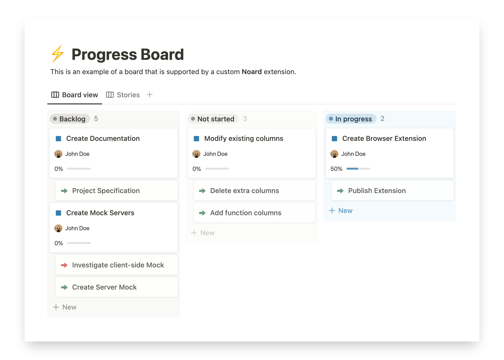

<h1 align="center">Noard</h1>

[link-rgh]: https://github.com/sindresorhus/refined-github
[link-ngh]: https://github.com/sindresorhus/notifier-for-github
[link-hfog]: https://github.com/sindresorhus/hide-files-on-github
[link-tsconfig]: https://github.com/sindresorhus/tsconfig
[link-options-sync]: https://github.com/fregante/webext-options-sync
[link-cws-keys]: https://github.com/fregante/chrome-webstore-upload/blob/main/How%20to%20generate%20Google%20API%20keys.md
[link-amo-keys]: https://addons.mozilla.org/en-US/developers/addon/api/key

> Cross-browser extension boilerplate - barebones template with Parcel 2, options handler and auto-publishing.

Screenshot of extension options:

## Develop

### 🛠 Build locally

1. Checkout the copied repository to your local machine.
2. Run `npm install` to install all required dependencies
3. Run `npm run build`

The build step will create the `distribution` folder, this folder will contain the generated extension.

### 🏃 Run the extension

Using [web-ext](https://extensionworkshop.com/documentation/develop/getting-started-with-web-ext/) is recommend for automatic reloading and running in a dedicated browser instance. Alternatively you can load the extension manually (see below).

1. Run `npm run watch` to watch for file changes and build continuously
1. Run `npm install --global web-ext` (only only for the first time)
1. In another terminal, run `web-ext run -t chromium`
2. Check that the extension is loaded by opening the extension options.

#### Manually

You can also [load the extension manually in Chrome](https://www.smashingmagazine.com/2017/04/browser-extension-edge-chrome-firefox-opera-brave-vivaldi/#google-chrome-opera-vivaldi) or [Firefox](https://www.smashingmagazine.com/2017/04/browser-extension-edge-chrome-firefox-opera-brave-vivaldi/#mozilla-firefox).

### ✏️ Make the first change

1. For example, edit source\manifest.json to `"name": "My Awesome Extension",`
1. Go back to your browser, reload and see the change take effect

Note: Firefox will automatically reload content scripts when the extension is updated, Chrome requires you to reload the page to reload the content scripts.

### 📕 Read the documentation

Here are some websites you should refer to:

- [Parcel’s Web Extension transformer documentation](https://parceljs.org/recipes/web-extension/)
- [Chrome extensions’ API list](https://developer.chrome.com/docs/extensions/reference/)
- A lot more links in my [Awesome WebExtensions](https://github.com/fregante/Awesome-WebExtensions) list

## Configuration

The extension doesn't target any specific ECMAScript environment or provide any transpiling by default. The extensions output will be the same ECMAScript you write. This allows us to always target the latest browser version, which is a good practice you should be following.

### Parcel 2

Being based on Parcel 2 and its [WebExtension transformer](https://parceljs.org/recipes/web-extension/), you get all the good parts:

- Browserlist-based code transpiling (which defaults to just the latest Chrome and Firefox versions)
- Automatically picks up any new file specified in `manifest.json`

### Auto-syncing options

Options are managed by [fregante/webext-options-sync][link-options-sync], which auto-saves and auto-restores the options form, applies defaults and runs migrations.

### Publishing

It's possible to automatically publish to both the Chrome Web Store and Mozilla Addons at once by adding these secrets on GitHub Actions:

1. `CLIENT_ID`, `CLIENT_SECRET`, and `REFRESH_TOKEN` from [Google APIs][link-cws-keys].
2. `WEB_EXT_API_KEY`, and `WEB_EXT_API_SECRET` from [AMO][link-amo-keys].

Also include `EXTENSION_ID` in the secrets ([how to find it](https://stackoverflow.com/a/8946415/288906)) and add Mozilla’s [`gecko.id`](https://developer.mozilla.org/en-US/docs/Mozilla/Add-ons/WebExtensions/manifest.json/browser_specific_settings) to `manifest.json`.

The GitHub Actions workflow will:

1. Build the extension
2. Create a version number based on the current UTC date time, like [`19.6.16`](https://github.com/fregante/daily-version-action) and sets it in the manifest.json
3. Deploy it to both stores

#### Auto-publishing

Thanks to the included [GitHub Action Workflows](.github/workflows), if you set up those secrets in the repo's Settings, the deployment will automatically happen:

- on a schedule, by default [every week](.github/workflows/deploy-automatic.yml) (but only if there are any new commits in the last tag)
- manually, by clicking ["Run workflow"](https://github.blog/changelog/2020-07-06-github-actions-manual-triggers-with-workflow_dispatch/) in the Actions tab.
